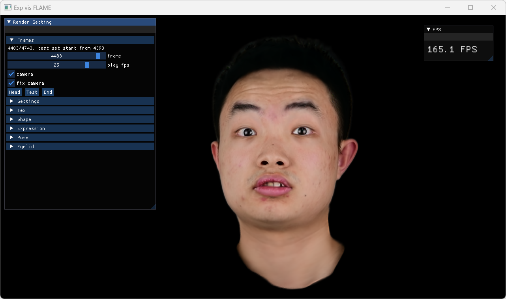

# Face Viewer

**[Paper](https://gapszju.github.io/GaussianBlendshape/static/pdf/Gaussian_Blendshape.pdf) | [Project Page](https://gapszju.github.io/GaussianBlendshape/)**   



Real-time Face Viewer for the paper "3D Gaussian Blendshapes for Head Avatar Animation". The training code can be found [here](https://github.com/zjumsj/GaussianBlendshapes.git)   

## Build

We have tested building on Ubuntu 18.04 with CUDA 11.8.

```
mkdir build
cd build
cmake ..
make
cd ..
```

Run viewer by
```
./build/bin/FaceViewer_FLAME --dataset=DATA_PATH/params --model=MODEL_PATH
```

The building on Windows is also possible but may require some modification to CMakeLists. Alternatively, We provide a pre-built binary [here](https://1drv.ms/u/c/592890cd0dc74114/ET5cl6p_Vo1Ekvcjrh_8JV0Bu9JzNZLstudb2kaXG48VZg).  

## Data process

You need to create an account on the [FLAME website](https://flame.is.tue.mpg.de/download.php) and download FLAME 2020 model.
Please unzip FLAME2020.zip and put generic_model.pkl under ./data/FLAME2020.

Then run 
```
python scripts/extract_tensor.py -i ./data/FLAME2020/generic_model.pkl -o ./data/FLAME2020
```

Run script to transform data format for viewer.
```
python scripts/extract_traj.py -i DATA_PATH/checkpoint -o DATA_PATH/params  
```

Pre-trained models are available [here](TODO).

## How to use  

**Basic Control**  
Use left button to rotate, right button to pan, and middle mouse button to zoom in and out.

**Set Current Frame**  
Select current frame under panel `Render Setting->Frames`.  
You can also use arrow keys to forward and rewind.  
Key P to start/stop playing animation.

**Rendering Mode**  
Use the number keys to select the rendering mode, 3 for Gaussian head avatar, and 1 for corresponding FLAME mesh.

**Others**  
Key C to enable/disable rendering coordinate.  
Key T to enable/disable rendering camera trajectory.

## Important hint

To reproduce the 370fps performance reported in the paper, please comment out ENABLE_VSYNC at line 36 and uncomment line 1810 in `FaceViewer_FLAME.cpp` and rebuild. By default, we have optimized out some unnecessary computations and enabled vsync.

If your goal is to have a side-to-side comparison with GT, you may comment out lines 1114-1116 in `FaceViewer_FLAME.cpp` for correct alignment and rebuild. You may also adjust window size, for example, set `--winWidth=512` and `--winHeight=512`.

 